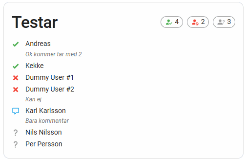

# Bokat.se Integration for Home Assistant

A custom integration for Home Assistant that connects to Bokat.se and allows you to track your activities.



## Features

- Login to Bokat.se with your credentials
- View all activities
- Display activity status in Home Assistant
- Regular updates of activity status
- View participant information including attendance status and comments
- Respond to events with attendance status, guest count, and comments
- Custom Lovelace card for easy interaction
- Standalone BokatAPI module for programmatic access to Bokat.se

## Installation

### HACS (Recommended)

1. Make sure [HACS](https://hacs.xyz/) is installed in your Home Assistant instance
2. Add this repository as a custom repository in HACS:
   - Go to HACS → Integrations → ⋮ → Custom repositories
   - Add `https://github.com/andymcloid/bokat_se_hass` with category "Integration"
3. Install the "Bokat.se" integration from HACS
4. **IMPORTANT: Manually register the Lovelace card (see section below)**
5. Restart Home Assistant

### Manual Installation

1. Download the latest release
2. Copy the `custom_components/bokat_se` directory to your Home Assistant `custom_components` directory
3. **IMPORTANT: Manually register the Lovelace card (see section below)**
4. Restart Home Assistant

### Register the Lovelace Card (Required for both HACS and Manual)

**The custom card must be manually registered as a resource in Home Assistant:**

1. Go to **Settings** → **Dashboards** → **Resources** (or **Configuration** → **Lovelace Dashboards** → **Resources** in older versions)
2. Click **"Add Resource"**
3. Enter the following details:
   - **URL**: `/bokat_se/bokat-se-card.js`
   - **Resource type**: **JavaScript Module**
4. Click **"Create"**
5. Clear your browser cache and reload the page

> **Note**: This is a one-time setup step that must be done manually. The integration does not automatically register the card to avoid potential conflicts with Home Assistant's resource management.

## Configuration

1. Go to Settings → Devices & Services
2. Click "Add Integration"
3. Search for "Bokat.se"
4. Enter your Bokat.se credentials (email and password)
5. Select which activity you want to track
6. Optionally, set a custom scan interval (5-180 minutes, default: 30)

## Usage

After configuration, a sensor will be created with the name based on your selected activity (e.g., `sensor.bokat_se_innebandy_sondag_kvall`). This sensor will display the name of the selected activity and will have the following attributes:

- `activity_name`: The name of the selected activity
- `activity_status`: The status of the selected activity (number of participants, etc.)
- `activity_url`: The URL to the activity on Bokat.se
- `activities`: A list of all your activities
- `participants`: A list of all participants with their attendance status and comments
- `total_participants`: Total number of participants
- `attending_count`: Number of participants attending
- `not_attending_count`: Number of participants not attending
- `no_response_count`: Number of participants who haven't responded
- `answer_url`: URL to respond to the event

## Services

The integration provides the following services:

- `bokat_se.refresh`: Refresh the data from Bokat.se
- `bokat_se.respond`: Respond to an event with attendance status, comment, and guests

### Service: bokat_se.refresh

Refresh the data from Bokat.se.

| Parameter | Description |
|-----------|-------------|
| entity_id | (Optional) The entity ID of the sensor to refresh. If not provided, all sensors will be refreshed. |

### Service: bokat_se.respond

Respond to an event with attendance status, comment, and guests.

| Parameter | Description |
|-----------|-------------|
| entity_id | (Required) The entity ID of the sensor. |
| attendance | (Required) The attendance status: "yes", "no", or "comment_only". |
| comment | (Optional) A comment to include with your response. |
| guests | (Optional) Number of guests you're bringing (only applicable when attendance is "yes"). Default: 0 |

## Lovelace Card

A custom Lovelace card is included to display the activity information and participant details. 

**Prerequisites**: Make sure you have registered the card as a resource (see installation section above).

To use the card:

1. Add the card to your dashboard:
   ```yaml
   type: 'custom:bokat-se-card'
   entity: sensor.bokat_se_your_activity_name
   title: 'Your Activity'
   ```

The card provides:
- Activity name and status
- Participant statistics (total, attending, not attending, no response)
- Detailed participant list with attendance status and comments
- Form to respond to the event with attendance status, guest count, and comments
- List of all activities with the ability to switch between them

### Troubleshooting the Lovelace Card

If the card doesn't appear in your dashboard or you get an error like "Custom element doesn't exist: bokat-se-card":

1. **Verify the resource is registered**:
   - Go to **Settings** → **Dashboards** → **Resources**
   - Make sure `/bokat_se/bokat-se-card.js` is listed as a **JavaScript Module**
   - If it's missing, add it manually (see installation section above)

2. **Clear browser cache**:
   - Hard refresh your browser (Ctrl+F5 or Cmd+Shift+R)
   - Or clear your browser cache completely

3. **Check the URL is accessible**:
   - Visit `http://your-ha-address:8123/bokat_se/bokat-se-card.js` directly
   - You should see JavaScript code, not a 404 error
   - If you get 404, restart Home Assistant

4. **Check Home Assistant logs**:
   - Look for any error messages related to `bokat_se`
   - Enable debug logging if needed: `logger.homeassistant.components.bokat_se: debug`

## Automation Examples

### Notify when activity status changes

```yaml
automation:
  - alias: "Notify when activity status changes"
    trigger:
      - platform: state
        entity_id: sensor.bokat_se_innebandy_sondag_kvall
    action:
      - service: notify.mobile_app
        data:
          title: "Bokat.se Activity Update"
          message: "{{ state_attr('sensor.bokat_se_innebandy_sondag_kvall', 'activity_status') }}"
```

### Notify when someone responds to an event

```yaml
automation:
  - alias: "Notify when someone responds to an event"
    trigger:
      - platform: state
        entity_id: sensor.bokat_se_innebandy_sondag_kvall
        attribute: attending_count
    action:
      - service: notify.mobile_app
        data:
          title: "Bokat.se Attendance Update"
          message: "{{ state_attr('sensor.bokat_se_innebandy_sondag_kvall', 'attending_count') }} people are now attending"
```

### Respond to an event via automation

```yaml
automation:
  - alias: "Automatically respond to an event"
    trigger:
      - platform: time
        at: "08:00:00"
    condition:
      - condition: template
        value_template: "{{ state_attr('sensor.bokat_se_innebandy_sondag_kvall', 'answer_url') != '' }}"
    action:
      - service: bokat_se.respond
        data:
          entity_id: sensor.bokat_se_innebandy_sondag_kvall
          attendance: "yes"
          comment: "I'll be there!"
          guests: 0
```

## License

MIT